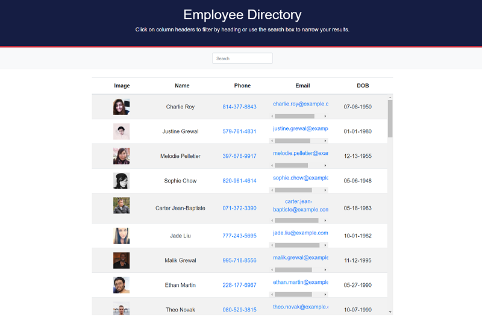

# Employee Directory (React Assignment)
## Description
This Employee Directory application was created with React. The application allows a user to view entire employee directory at once so that the user has quick access to their information. An employee or manager would benefit greatly from being able to view non-sensitive data about other employees. The user is also able to filter employees by name or sort in alphabetical order.

- Link to the live application on GitHub pages: https://nagck.github.io/employee-dir/
- Link to the GitHub repository: https://github.com/nagck/employee-dir

The application's UI has been split into components, manage component state, and respond to user events.

## User Story
* As a user, I want to be able to view my entire employee directory at once so that I have quick access to their information.

An employee or manager would benefit greatly from being able to view non-sensitive data about other employees. It would be particularly helpful to be able to filter employees by name.

Given a table of random users generated from the [Random User API](https://randomuser.me/), when the user loads the page, a table of employees will be rendered. 

The user is able to:

  * Sort the table by different category

  * Filter the users by different property

## Technologies Used: 
* React Libray
* Node.js, Express
* JavaScript, HTML, CSS/Bootstrap
* npm
* Axios API
* Random User Generator API

## Installation/Usage

This project was bootstrapped with [Create React App](https://github.com/facebook/create-react-app).

Please follow GitHub's guidelines to clone the repository and/or download the zip file. 

### Available Scripts

In the project directory, you can run:

### `npm start`

Runs the app in the development mode.\
Open [http://localhost:3000](http://localhost:3000) to view it in the browser.

The page will reload if you make edits.

### `npm run build`

Builds the app for production to the `build` folder.\
It correctly bundles React in production mode and optimizes the build for the best performance.

The build is minified and the filenames include the hashes.\
Your app is ready to be deployed!

## Screenshots of the application:

## Link to functional application deployed on GitHub Pages:

https://nagck.github.io/employee-dir/

## Credits

- The application has been developed using React, JavaScript, Node.js, Express, Bootstrap. 

- Sincere thanks to my course instructors Ed (Edward Apostol), Herman (German Arcila) and Anas (Anas Qazi) for teaching and helping me in acquiring HTML/CSS/JavaScript/Node.js/MongoDB/Mongoose/React  skills. And of course thanks to my fellow students for sharing valuable tips and tricks on Slack study groups.

- Here are some websites that I referred to develop the code:
* https://reactjs.org/
* https://github.com/facebook/create-react-app
* https://www.npmjs.com/package/axios
* https://www.npmjs.com/
* https://www.npmjs.com/package/express
* https://www.w3schools.com/nodejs/
* https://developer.mozilla.org/en-US/docs/Web/JavaScript
* https://www.w3schools.com/js/default.asp
* https://randomuser.me/

## License
Licensed under the [MIT](https://choosealicense.com/licenses/mit/) license.  
 
## Feedback
Feedback is always appreciated. If you are interested in fixing any issues and contributing directly to the code base, please provide at:
- GitHub Pull Requests: [https://github.com/nagck/employee-dir/pulls](https://github.com/nagck/employee-dir/pulls)
- GitHub: [https://github.com/nagck](https://github.com/nagck)

---
